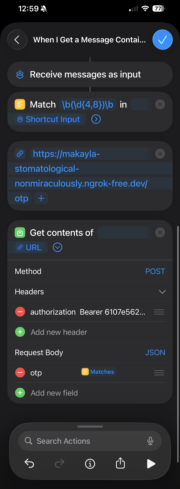

# Phone OTP

A seamless solution for automatically filling OTP codes from your phone directly into your browser, eliminating the need to manually copy-paste verification codes.

## The Problem

Modern web applications frequently require OTP verification, forcing users to:
- Switch between devices to retrieve codes
- Manually copy codes from SMS messages
- Type codes into browser forms, risking typos
- Deal with time-sensitive codes that expire quickly

**This creates friction in the authentication flow, especially when codes arrive on a separate device.**

## The Solution

Phone OTP creates a secure bridge between your phone and browser:

1. **Phone receives SMS** with OTP code
2. **iOS Shortcut extracts** the code and sends it to the server
3. **Server routes** the OTP through a location-verified channel
4. **Browser extension** automatically detects and fills OTP input fields

The entire process happens in seconds, requiring zero manual intervention.

## Architecture Overview

```
┌──────────────┐         ┌──────────────┐         ┌──────────────────┐
│    Phone     │         │    Server    │         │  Browser Ext.    │
│(iOS Shortcut)│  HTTPS  │ (Hono + Bun) │  HTTPS  │ (Chrome/Chromium)│
│              ├────────►│              │◄────────┤                  │
│ POST /otp    │         │   OTP Bus    │         │  GET /otp        │
│ + OTP code   │         │  (Pub/Sub)   │         │  (Long-polling)  │
└──────────────┘         └──────────────┘         └──────────────────┘
       │                        │                          │
       │                  Location Hash                    │
       │                   Middleware                      │
       │                        │                          │
       └────────────────────────┴──────────────────────────┘
                    Geographic validation layer
```

## Tech Stack

### Extension
- **TypeScript**: Type-safe development
- **Bun**: Fast bundler and runtime for build process
- **Chrome Extension Manifest V3**: Modern extension platform
- **Chrome Storage API**: Local OTP caching

### Server
- **[Hono](https://hono.dev)**: Ultra-fast web framework
- **[Bun](https://bun.sh)**: JavaScript runtime with native TypeScript support
- **In-memory pub-sub**: Custom OTP message bus for real-time delivery
- **IP Geolocation**: Location-based security validation

## How It Works

### Browser Extension Flow

1. **Content Script** monitors all web pages for OTP input fields using:
   - Standard autocomplete attributes (`autocomplete="one-time-code"`)
   - Common naming patterns (`name="otp"`, `id="code"`, etc.)
   - MutationObserver for dynamically injected fields

2. **Service Worker** manages OTP retrieval:
   - Polls `GET /otp` endpoint every 600ms when waiting
   - Caches OTPs in local storage with 30-second TTL
   - Handles concurrent requests from multiple tabs
   - Includes `EXTENSION_TOKEN` bearer token for authentication

3. **Auto-fill** executes via `document.execCommand('insertText')` to:
   - Trigger native input events
   - Maintain compatibility with form validation
   - Work with frameworks like React/Vue

### Server Architecture

**Authentication Layer**:
- Extension requests validated via bearer token authentication
- Phone submissions validated via separate bearer token
- Both use the same token validation middleware for consistency
- Prevents unauthorized access from both sides

**Location Hashing**:
- Extracts IP from connection or `X-Forwarded-For` header
- Queries geolocation API for country/region/city
- Generates deterministic hash for channel isolation
- Ensures OTPs only route to devices in same region

**OTP Bus (Pub-Sub)**:
- In-memory message broker with channel-based routing
- Phones publish to channels identified by location hash
- Extensions subscribe to matching channels
- Automatic timeout handling (60s for extension, 25s for phone)
- Race condition prevention: publishers wait for subscribers
- Designed for serverless deployment where maintaining in-memory state keeps the server instance active and responsive

**Coordination Pattern**:
1. Extension subscribes to channel → notifies waiters
2. Phone waits for subscriber → publishes OTP
3. Bus delivers OTP → extension receives and caches
4. Content script auto-fills → user verified

### Phone Integration (iOS Shortcuts)

The iOS Shortcut automates OTP forwarding whenever a verification code is received via SMS.

#### How It Works

1. **Automation Trigger**: An automation runs when a message is received containing the word "code"
2. **Regex Extraction**: Uses regular expression pattern to match 4-6 digit codes from the message text
3. **HTTP Request**: Sends a POST request to the server endpoint with:
   - `Authorization: Bearer <PHONE_AUTH_TOKEN>` header
   - JSON body containing the matched OTP: `{ "otp": "123456" }`
4. **Error Handling**: Silently fails if no code is matched or server is unreachable

#### Shortcut Structure



The shortcut is configured as a personal automation that triggers on incoming messages, parses the SMS content, and forwards the extracted code to your server.

## Getting Started

### Prerequisites
- [Bun](https://bun.sh) installed
- Chrome or Chromium-based browser
- iOS device with Shortcuts app (for phone integration)

### Setup

1. **Clone and install**:
```bash
git clone <repository-url>
cd phone-otp
bun install
```

2. **Configure environment** (`.env` file):
```env
EXTENSION_TOKEN=your-secure-extension-token
PHONE_AUTH_TOKEN=your-secure-phone-token
PUBLIC_SERVER_URL=https://your-server-url.com
```

3. **Start the server**:
```bash
cd server
bun run dev
```

4. **Build the extension**:
```bash
cd extension
bun run build
```

5. **Load extension in Chrome**:
   - Navigate to `chrome://extensions/`
   - Enable "Developer mode"
   - Click "Load unpacked"
   - Select `extension/dist/` folder

6. **Set up iOS Shortcut** (see Phone Integration section above)

### Usage

Once configured:
1. Navigate to any website requiring OTP verification
2. OTP input field appears (auto-detected by extension)
3. Check your phone for the OTP message
4. iOS Shortcut automatically sends OTP to server
5. Extension polls server and receives OTP
6. OTP auto-fills in browser
7. Submit form (or extension auto-submits if configured)

## Security Considerations

- **Token-based authentication**: Separate bearer tokens for phone and extension with unified validation
- **Location validation**: Geographic hash prevents cross-region OTP interception
- **Time-limited OTPs**: 30-second TTL in extension cache
- **In-memory storage**: No persistent OTP storage on server
- **HTTPS required**: All communication encrypted in transit
- **Consistent auth middleware**: Reusable token validation ensures security across all endpoints

## Development

### Extension Development
```bash
cd extension
bun run dev  # Watch mode with hot-reload
```

### Server Development
```bash
cd server
bun run dev  # Hot-reload with NODE_ENV=development
```

## License

MIT License - Free and open source for everyone to use, modify, and distribute.
